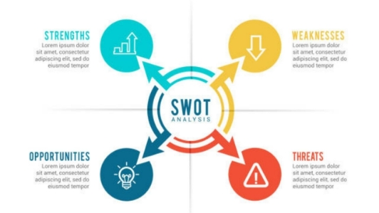

**Requirements** 

**Introduction:**

The Airline reservation system is designed for users to reserve a seat, cancel, display seat and exit the system. A formula is included in the function to calculate the seats are reserved. A few flow charts are also created for explaining the process of the Airline reservation system. 

A small airline has just purchased a computer for its new automated reservation system. Here, I am writing a program to assign seats on each flight of the airlines only place (capacity: 15 seats). This program should never assign a seat which is already assigned. If there’s no seat available, then print the message " the flight is full ".

**Research:**

Online Air Ticketing is a kind of user assistance where customers can book tickets for flight online. This models airline performance as a function of computerized reservations systems ownership at two levels: for selected city-pairs and at the overall level of the firm. 

**https://en.wikipedia.org/wiki/Airline\_ticket**

**Cost and Features and Timeline:**

**(a)Cost:** 

The flight booking app’s cost depends on distinct features that you want to append to your app. Appending the dynamic functionalities will push the cost of the development quite high. On the other hand, running with basic functionalities will come up with relatively less pricing

**(b)Features:**

- Flight search option (Round-trip, one-way, etc)
- Flight reservations
- Seat upgrades
- Calendar Availability
- Flight cancellation
- Flight quotation booking system
- Other travel services (hotel, transfer, etc.)

**(c)Timeline:**

We chose events that depict the gradual change of reservation systems, giving a solid understanding of how airline distribution developed. By looking at this history timeline, you’ll be able to understand, at least partially, how the modern flight reservation market formed.

**Defining Our System:**

The airline reservation system is a web-based booking solution that helps in consolidating data from all airlines through the use of global distribution systems. The system provides inventory and rates in real time to customers as well as travel agents.

` `**SWOT Analysis:**

**1. Strength**

A major** strength is the safety record, and the associated public acceptance of air travel as both a fast and safe way to travel.

Another strength of any airline is the product itself--air travel.

**2. Weakness**

This can be exacerbated during operational irregularities

Airlines have difficulty making quick schedule

**3. Opportunities**	

Innovations

Providing personalised offers and discounts

**4. Threats**

A global economic downturn negatively affects leisure.

An upward spike can destabilize the business model.

**4W's and 1'H**

**1.Who:**

Customers, Investors and Clients.

**2.What:**

Creating set of operations for the Online Reservations 

**3.When:**

When customer's fill the details has to be stored and maintain in DB

**4.Where:**

At present the project execution lunch locally on system

**How:**

Based on the research, identifying the features and implementing the requirements in the C programming language and test them to delivering the product.

**Details of Requirements:**

**High level requirements:**

|**ID**|**Description**|**Status**|
| :-: | :-: | :-: |
|1|Register, update, administrate.|Implemented|
|2|Enable online customers registration system and generate user statistics.|Implemented|
|3|Provides up-to-date information and the Customers and available flight.|Implemented|

**Software Requirements:**

|**ID**|**Description**|**Status**|
| :-: | :-: | :-: |
|1|If our users are not committed for this development project.|Implemented|
|2|Our users can’t prioritize needs|Implemented|
|3|If our users refuse to take responsibility for the system.|Implemented|

