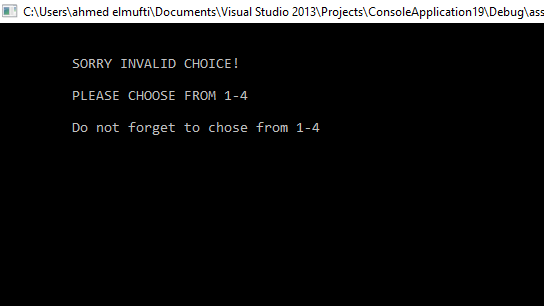
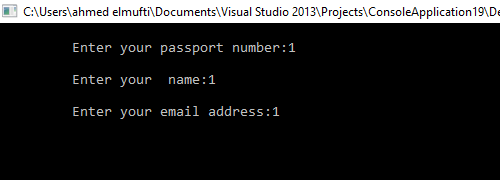
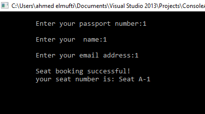
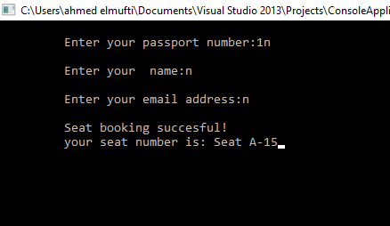
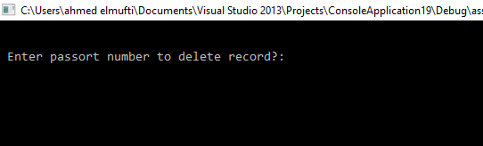
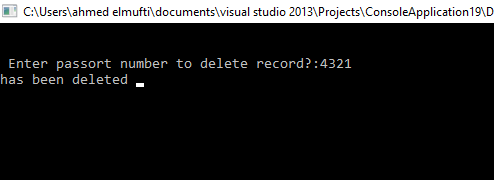

# Screenshots

` `*Main Menu interface*

When the program is executed, the user will be directed to the main menu interface. The program is introduced with a few lines of texts. Then four selections are made for the user as the user can choose to reserve, cancel, display or exit the program.

` `*Invalid value entered (main menu)*

If the user accidentally enters an invalid input, an interface will be shown to notify the user to choose again and it notify the user again to enter from 1-4.

`  `

`                                                            `*reservation function*

The program is asking the user to enter passport number, name, and the email address to reserve a seat for the user and the seat cannot be book for anyone else.

*Figure  SEQ Figure \\* ARABIC 10: Invalid Command (LED Selection Menu)*

`                 `

*Figure the seat has successfully booked* 

As shown in the interface the seat reservation has been booked successfully, after the user has entered the details. 

`             `

` `*15 is the maximum seats number the program could not book any more seat*

After registering 15 users in the system now the flight supposed to be full and cannot except anymore. 

`                    `

*Figure it is displaying the no more seat available that cannot book any seat* 

The system will pop out to notify the user that there’s no seat available, the flight contains only 15 seats after that it is displaying it is full sorry, we cannot register anymore. 

`    `

`                                                             `*cancel function* 

`    `After the passenger entered 3 and want to cancel the record, after that, the program requires the user to enter which passport number to delete it. For example, that mufti registered the seat in the flight and he wants to cancel it.

                     

` `The system asking mufti to enter his passport number to cancel it from the system without any problems and in efficient way. After mufti entered his passport number the system pop in your record has been deleted from the system.

If mufti entered the wrong passport number by mistake the system pop in hey ahmed passport number is wrong, please check your passport number and enter it again.

The interface is displaying all the users record that now you have two seats ahmed with his details and mufti with his details as well. There’s line between the users to make it clear to read and do not misunderstand it.  display function 

After mufti cancel his seat from the system, the interface is showing that only ahmed in the system and mufti’s seat already deleted.

after entered 4 which is exit function, it is storing all the records into file with all the passenger’s details in mufti record. 

` `The interface is showing the record in notepad which is the storing part and it is displaying ahmed and his details after mufti cancel his record.
